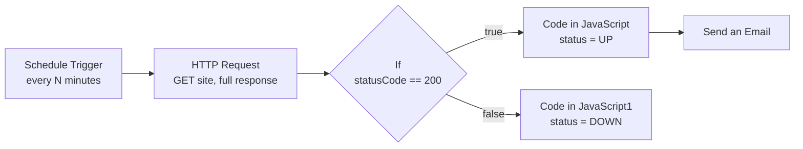

# Website Uptime Monitor – n8n Workflow

An n8n workflow that periodically pings a website, checks the HTTP status code, and builds an UP / DOWN status report that can be emailed via SMTP.

## Overview

On every scheduled run the workflow:

1. Sends a `GET` request to the monitored URL (`https://demo.realworld.show/`) and captures the full response, including the status code.
2. Checks whether the HTTP status code equals `200`.
3. Builds a status object:
   - **UP** if the code is 200: "Website is running normally."
   - **DOWN** otherwise: "Website is down or returned an unexpected HTTP status."
4. Each status object includes the status, message, HTTP status code, and a UTC timestamp.
5. The UP status is emailed through SMTP (see [Known Limitations](#known-limitations--suggested-improvements) for an important note on this).

## Workflow Diagram



## Nodes

| # | Node | Type | What it does |
|---|------|------|--------------|
| 1 | **Schedule Trigger** | Schedule Trigger | Starts the workflow on a minutes-based interval. |
| 2 | **HTTP Request** | HTTP Request | `GET https://demo.realworld.show/` with **Full Response** enabled, so the output includes `statusCode`, headers, and body. |
| 3 | **If** | If | Checks `{{ $json.statusCode }}` equals `200`. True goes to the UP node, false goes to the DOWN node. |
| 4 | **Code in JavaScript** | Code (JS) | Outputs `{ status: "UP", message, status_code, checked_at }`. |
| 5 | **Code in JavaScript1** | Code (JS) | Outputs `{ status: "DOWN", message, status_code, checked_at }`. |
| 6 | **Send an Email** | Email Send (SMTP) | Sends a plain-text email with subject **Website Uptime Alert**. Currently wired to the UP branch only. |

## Sample Email Output

**Subject:** `Website Uptime Alert`

```
WEBSITE ALERT

Status: UP

HTTP Status Code: 200

Website is running normally.

Checked At:
2026-09-29T10:00:00.000Z
```

## Setup

### Prerequisites

- An [n8n](https://n8n.io) instance (cloud or self-hosted)
- An SMTP account (Gmail, Outlook, SendGrid, etc.)

### Steps

1. In n8n, go to **Workflows → Import from File** and select `Bonus_UptimeMonitor_CharithaSri.json`.
2. Open the **Schedule Trigger** and set how many minutes should pass between checks.
3. Open the **HTTP Request** node and replace the URL with the site you want to monitor.
4. Open the **Send an Email** node and:
   - Select or create your **SMTP credential**.
   - Set **From Email** to an address your SMTP account is allowed to send from.
   - Set **To Email** to the address that should receive alerts.
5. Click **Execute Workflow** to test it.
6. Toggle the workflow to **Active** to start monitoring.

> **Gmail users:** use an [App Password](https://support.google.com/accounts/answer/185833) instead of your normal password (requires 2-Step Verification).

## Configuration

| Setting | Where | Current value |
|---------|-------|---------------|
| Check frequency | Schedule Trigger | Minutes-based interval (value not set in the JSON, so n8n's default applies; confirm in the node) |
| Monitored URL | HTTP Request | `https://demo.realworld.show/` |
| Healthy status code | If | `200` |
| Email subject | Send an Email | `Website Uptime Alert` |
| Email recipient / sender | Send an Email | Set in node |

## Known Limitations & Suggested Improvements

- **Email is sent on UP, not DOWN:** the email node is connected only to the UP branch, and the DOWN branch (`Code in JavaScript1`) is a dead end. Since the email is titled "WEBSITE ALERT", you almost certainly want it on the DOWN path. Connect `Code in JavaScript1` to `Send an Email` and remove or replace the UP connection. If you also want periodic "all good" reports, use a second email node for UP.
- **DOWN branch is rarely reached:** by default the HTTP Request node throws an error on 4xx/5xx responses and on connection failures (timeouts, DNS errors), which stops the workflow before the `If` node runs. To make the DOWN branch work, open **HTTP Request → Options** and enable **Response → Never Error** (a.k.a. "Never error"), and consider setting a **Timeout**. Alternatively, set the node's **On Error** setting to *Continue (using error output)* and route the error output to the DOWN branch.
- **Only `200` counts as healthy:** other successful codes such as `204` are treated as DOWN. Consider checking for `>= 200 and < 300` instead.
- **Alert spam:** once the DOWN alert is wired up, an outage will trigger an email on every run. Consider storing the last known state (workflow static data or a database) and emailing only when the status changes.
- **Single URL:** the workflow monitors one site. To watch several, feed a list of URLs into the HTTP Request node.

## Tech Stack

- [n8n](https://n8n.io) workflow automation
- JavaScript (n8n Code nodes)
- SMTP for email delivery

## Files

- `Bonus_UptimeMonitor_CharithaSri.json` – the exportable n8n workflow
- `README_UptimeMonitor.md` – this document
