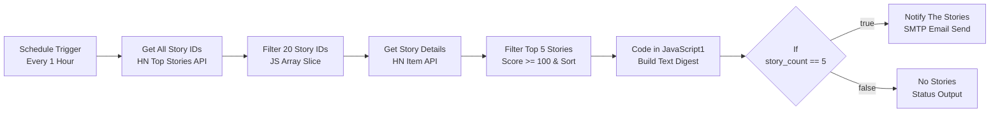
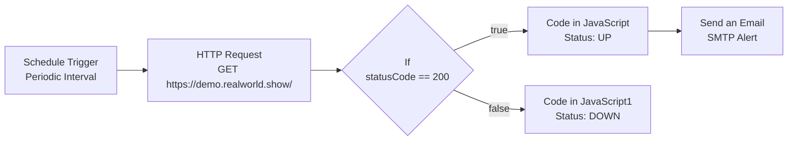

# Automation & QA Developer Assessment

[](https://n8n.io)
[](https://github.com/HackerNews/API)
[](file:///c:/Users/chari/OneDrive/Documents/Automation_qa_developer_assessment/Task1_QA_Report/Task1_QA_Report_CharithaSri.pdf)
[](https://n8n.io)

Comprehensive repository containing automated workflow solutions built on **n8n** and comprehensive QA testing reports for the **Automation QA Developer Assessment**. 

---

## 📋 Table of Contents

- [Overview](#-overview)
- [Repository Structure](#-repository-structure)
- [Task 1: QA Bug & Assessment Report](#-task-1-qa-bug--assessment-report)
- [Task 2: Hacker News Hourly Digest](#-task-2-hacker-news-hourly-digest)
  - [Workflow Architecture](#workflow-architecture)
  - [Node Breakdown](#node-breakdown)
  - [Configuration & Setup](#configuration--setup)
  - [Sample Output & Screenshots](#sample-output--screenshots)
  - [QA & Engineering Analysis](#qa--engineering-analysis)
- [Bonus Task: Website Uptime Monitor](#-bonus-task-website-uptime-monitor)
  - [Workflow Architecture](#workflow-architecture-1)
  - [Node Breakdown](#node-breakdown-1)
  - [Configuration & Setup](#configuration--setup-1)
  - [Sample Output & Screenshots](#sample-output--screenshots-1)
  - [QA & Engineering Analysis](#qa--engineering-analysis-1)
- [Importing Workflows into n8n](#-importing-workflows-into-n8n)
- [Tech Stack](#-tech-stack)

---

## 🔍 Overview

This assessment demonstrates end-to-end QA manual testing, defect reporting, workflow automation, API integration, data manipulation with JavaScript, error handling, and SMTP notification systems.

1. **Task 1: QA Bug & Assessment Report** – Formal QA test execution and bug report targeting the RealWorld Conduit web application (`https://demo.realworld.show/`), documenting critical user-facing issues and quality analysis in PDF format.
2. **Task 2: Hacker News Hourly Digest** – Periodically fetches top stories from the official Hacker News API, filters items scoring $\ge 100$, formats the top 5 articles into a structured digest, and emails the digest to subscribers.
3. **Bonus Task: Website Uptime Monitor** – Periodically pings a specified web endpoint (`https://demo.realworld.show/`), evaluates HTTP status codes, formats detailed execution metrics (status code, UTC timestamp), and handles status notification workflows.

---

## 📁 Repository Structure

```
automation_qa_developer_assessment/
├── README.md                                  # Global Repository Documentation
├── Task1_QA_Report/                           # Task 1: QA Testing & Bug Report
│   └── Task1_QA_Report_CharithaSri.pdf        # Formal QA Bug Report (PDF)
├── Task2_n8n_API_workflow/                    # Task 2: Hacker News Digest Solution
│   ├── Task2_Workflow_CharithaSri.json       # n8n Workflow JSON Export
│   ├── README.md                              # Detailed Task 2 Documentation
│   └── screenshots/                           # Execution & Workflow Screenshots
│       ├── workflow.png
│       └── successful_execution.png
└── Bonus_Uptime_Monitor/                      # Bonus: Website Uptime Monitor Solution
    ├── Bonus_UptimeMonitor_CharithaSri.json   # n8n Workflow JSON Export
    ├── README.md                              # Detailed Uptime Monitor Documentation
    ├── workflow.png                           # Workflow Diagram Screenshot
    └── successful_execution.png               # Execution Screenshot
```

---

## 📑 Task 1: QA Bug & Assessment Report

The QA testing report evaluates the RealWorld Conduit Web Application (`https://demo.realworld.show/`).

- **Document Path:** [`Task1_QA_Report_CharithaSri.pdf`](file:///c:/Users/chari/OneDrive/Documents/Automation_qa_developer_assessment/Task1_QA_Report/Task1_QA_Report_CharithaSri.pdf)
- **Scope:** Functional testing, UI/UX consistency, API behavior validation, edge case identification, and defect documentation.

---

## 📰 Task 2: Hacker News Hourly Digest

### Workflow Architecture



### Node Breakdown

| # | Node Name | Type | Purpose / Logic |
|---|-----------|------|-----------------|
| 1 | **Schedule Trigger** | `Schedule Trigger` | Triggers the execution once every hour. |
| 2 | **Get All Story ID's** | `HTTP Request` | `GET https://hacker-news.firebaseio.com/v0/topstories.json` |
| 3 | **Filter 20 story Id's** | `Code (JS)` | Takes the top 20 story IDs (`items.slice(0, 20)`). |
| 4 | **Get Story Details** | `HTTP Request` | `GET https://hacker-news.firebaseio.com/v0/item/{story_id}.json` |
| 5 | **Filter Top 5 Stories** | `Code (JS)` | Filters items with `score >= 100`, sorts descending, keeps top 5. |
| 6 | **Code in JavaScript1** | `Code (JS)` | Formats text digest, subject header, and `story_count`. |
| 7 | **If** | `If` | Validates if `story_count == 5`. |
| 8 | **Notify The Stories** | `Email Send (SMTP)` | Sends the formatted plain-text email digest to recipient. |
| 9 | **No Stories** | `Code (JS)` | Handles case when score criteria is not met. |

### Configuration & Setup

- **Import File:** [`Task2_Workflow_CharithaSri.json`](file:///c:/Users/chari/OneDrive/Documents/Automation_qa_developer_assessment/Task2_n8n_API_workflow/Task2_Workflow_CharithaSri.json)
- **SMTP Setup:** Configure Host, Port, Credentials, `From Email`, and `To Email` in the *Notify The Stories* node.
- **Threshold Tuning:** Default minimum score is `100`, candidate pool is `20` items, digest capacity is `5` stories.

### Sample Output & Screenshots

**Sample Email Digest Body:**
```text
Subject: Hacker News Hourly Digest

1. Show HN: High-performance async runtime
Score: 420
Author: dev_guru
Comments: 184
https://news.ycombinator.com/item?id=3849102

2. Modern Architecture Patterns in 2026
Score: 285
Author: arch_master
Comments: 92
https://example.com/modern-architecture
```

*Visual Screenshots:*
- [Workflow Structure](file:///c:/Users/chari/OneDrive/Documents/Automation_qa_developer_assessment/Task2_n8n_API_workflow/screenshots/workflow.png)
- [Successful Execution Log](file:///c:/Users/chari/OneDrive/Documents/Automation_qa_developer_assessment/Task2_n8n_API_workflow/screenshots/successful_execution.png)

### QA & Engineering Analysis

- **Strict `If` Equality:** The condition checks `story_count == 5`. If 1 to 4 stories meet score threshold $\ge 100$, it routes to *No Stories*. **Recommendation:** Change condition to `story_count >= 1`.
- **API Batching:** Fetches items sequentially; for larger item sets, batching HTTP requests reduces API latency.

---

## ⚡ Bonus Task: Website Uptime Monitor

### Workflow Architecture



### Node Breakdown

| # | Node Name | Type | Purpose / Logic |
|---|-----------|------|-----------------|
| 1 | **Schedule Trigger** | `Schedule Trigger` | Runs check periodically. |
| 2 | **HTTP Request** | `HTTP Request` | `GET https://demo.realworld.show/` with full response output. |
| 3 | **If** | `If` | Checks if `statusCode == 200`. |
| 4 | **Code in JavaScript** | `Code (JS)` | Constructs `{ status: "UP", message, status_code, checked_at }`. |
| 5 | **Code in JavaScript1** | `Code (JS)` | Constructs `{ status: "DOWN", message, status_code, checked_at }`. |
| 6 | **Send an Email** | `Email Send (SMTP)` | Transmits notification message via SMTP. |

### Configuration & Setup

- **Import File:** [`Bonus_UptimeMonitor_CharithaSri.json`](file:///c:/Users/chari/OneDrive/Documents/Automation_qa_developer_assessment/Bonus_Uptime_Monitor/Bonus_UptimeMonitor_CharithaSri.json)
- **Target URL:** `https://demo.realworld.show/` (customizable in HTTP Request node).

### Sample Output & Screenshots

**Sample Uptime Alert:**
```text
Subject: Website Uptime Alert

WEBSITE ALERT

Status: UP
HTTP Status Code: 200
Website is running normally.

Checked At: 2026-09-29T10:00:00.000Z
```

*Visual Screenshots:*
- [Workflow Diagram](file:///c:/Users/chari/OneDrive/Documents/Automation_qa_developer_assessment/Bonus_Uptime_Monitor/workflow.png)
- [Successful Execution Log](file:///c:/Users/chari/OneDrive/Documents/Automation_qa_developer_assessment/Bonus_Uptime_Monitor/successful_execution.png)

### QA & Engineering Analysis

- **Alert Routing Improvement:** Email node should be connected to the **DOWN** branch for real-time failure alerts, or dual-routed to send digests/alerts appropriately.
- **HTTP Node Failures:** HTTP Request node should have `Response -> Never Error` enabled so 4xx/5xx responses pass to the `If` node rather than throwing workflow exceptions.

---

## 📥 Importing Workflows into n8n

1. Launch your **n8n** instance (Cloud or Desktop/Docker).
2. Click **Workflows** $\rightarrow$ **Import from File...**
3. Select either JSON export:
   - `Task2_n8n_API_workflow/Task2_Workflow_CharithaSri.json`
   - `Bonus_Uptime_Monitor/Bonus_UptimeMonitor_CharithaSri.json`
4. Attach your target **SMTP credentials**.
5. Save & Activate the workflow.

---

## 🛠️ Tech Stack

- **QA & Testing:** Manual QA, PDF Bug Reporting
- **Workflow Engine:** [n8n](https://n8n.io)
- **APIs:** Hacker News Firebase API
- **Scripting:** JavaScript (Node.js ES6 inside n8n Code Nodes)
- **Protocols:** HTTP/REST, SMTP
- **Version Control:** Git, GitHub
