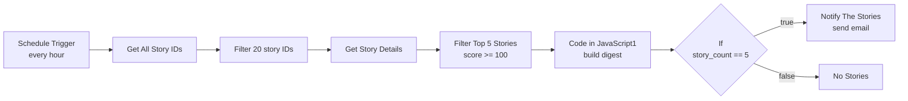

# Hacker News Hourly Digest – n8n Workflow

An n8n workflow that checks Hacker News every hour, picks the top-scoring stories, and emails them to you as a plain-text digest.

## Overview

Every hour the workflow:

1. Fetches the current list of top story IDs from the official Hacker News API.
2. Keeps the first 20 IDs.
3. Fetches full details for each of those 20 stories.
4. Filters to stories with a **score of 100 or more**, sorts them by score (highest first), and keeps the **top 5**.
5. Formats them into a readable text digest.
6. Sends the digest by email (SMTP) if 5 stories qualified; otherwise takes the "No Stories" branch.

No API key is needed for Hacker News. The only credential required is an SMTP account for sending email.

## Workflow Diagram



## Nodes

| # | Node | Type | What it does |
|---|------|------|--------------|
| 1 | **Schedule Trigger** | Schedule Trigger | Starts the workflow on an hourly interval. |
| 2 | **Get All Story ID's** | HTTP Request | `GET https://hacker-news.firebaseio.com/v0/topstories.json` – returns the list of current top story IDs. |
| 3 | **Filter 20 story Id's** | Code (JS) | Takes the first 20 IDs and outputs them as items shaped `{ story_id }`. |
| 4 | **Get Story Details** | HTTP Request | `GET https://hacker-news.firebaseio.com/v0/item/{story_id}.json` – fetches title, score, author, comment count, and URL for each story. |
| 5 | **Filter Top 5 Stories** | Code (JS) | Keeps stories with `score >= 100`, sorts by score descending, returns the top 5. |
| 6 | **Code in JavaScript1** | Code (JS) | Builds one item containing `notification` (email subject), `story_count`, and `digest` (formatted email body). |
| 7 | **If** | If | Checks whether `story_count` equals `5`. True goes to the email node, false goes to "No Stories". |
| 8 | **Notify The Stories** | Email Send (SMTP) | Sends the digest as a plain-text email. |
| 9 | **No Stories** | Code (JS) | Returns a status message (`NO_HIGH_SCORE_STORIES`, threshold 100). Does not send anything. |

## Sample Email Output

**Subject:** `Hacker News Hourly Digest`

```
1. Example Story Title
Score: 342
Author: username
Comments: 128
https://example.com/article

2. Another Story Title
Score: 210
Author: someone
Comments: 64
https://example.com/another
...
```

If a story has no external URL (for example an Ask HN post), the link falls back to its Hacker News page: `https://news.ycombinator.com/item?id=<id>`.

## Setup

### Prerequisites

- An [n8n](https://n8n.io) instance (cloud or self-hosted)
- An SMTP account (Gmail, Outlook, SendGrid, etc.)

### Steps

1. In n8n, go to **Workflows → Import from File** and select `Task2_Workflow_[CharithaSri].json`.
2. Open the **Notify The Stories** node and:
   - Select or create your **SMTP credential** (host, port, username, password / app password).
   - Set **From Email** to an address your SMTP account is allowed to send from.
   - Set **To Email** to the recipient of the digest.
3. Click **Execute Workflow** to test it manually.
4. Toggle the workflow to **Active** so the hourly schedule runs.

> **Gmail users:** use an [App Password](https://support.google.com/accounts/answer/185833) rather than your normal password (requires 2-Step Verification).

## Configuration

| Setting | Where | Default |
|---------|-------|---------|
| Run frequency | Schedule Trigger | Every 1 hour |
| Number of stories scanned | `Filter 20 story Id's` → `slice(0, 20)` | 20 |
| Minimum score | `Filter Top 5 Stories` → `>= 100` | 100 |
| Stories included in digest | `Filter Top 5 Stories` → `slice(0, 5)` | 5 |
| Email recipient / sender | `Notify The Stories` | Set in node |

## Known Limitations & Suggested Improvements

- **Exact-match condition:** the `If` node checks `story_count equals 5`. If only 1–4 stories score 100+, the workflow goes to **No Stories** even though qualifying stories exist. Change the condition to **greater than or equal to 1** (or `> 0`) so partial digests are still emailed.
- **Misleading "No Stories" message:** that node's text says no stories met the threshold, which is only accurate when zero qualify.
- **"No Stories" is a dead end:** it only outputs data. Connect it to a notification node if you want to be told when nothing qualified, or leave it as-is to stay silent.
- **Small candidate pool:** only the first 20 top stories are checked, so fewer stories may hit the score threshold. Increase the slice size if you want a wider net.
- **Repeat stories:** a story that stays on the front page will appear in consecutive hourly emails. You could add de-duplication using workflow static data or a small database.
- **Sequential requests:** story details are fetched via an HTTP node per item; for larger batches consider batching options to be gentle on the API.

## Tech Stack

- [n8n](https://n8n.io) workflow automation
- [Hacker News API](https://github.com/HackerNews/API) (Firebase)
- JavaScript (n8n Code nodes)
- SMTP for email delivery

## Files

- `Task2_Workflow_[CharithaSri].json` – the exportable n8n workflow
- `README.md` – this document
